# PROJECT FLOW - JOB PLATFORM SYSTEM

## 1. Tổng quan hệ thống

Job Platform System là hệ thống tuyển dụng trực tuyến gồm các nhóm chức năng chính:

* Xác thực người dùng: đăng ký, đăng nhập, refresh token, logout, đổi mật khẩu, quên mật khẩu.
* Quản lý người dùng: xem danh sách, xem chi tiết, tìm kiếm, phân trang, xóa user.
* Quản lý tin tuyển dụng: tạo job, sửa job, xóa job, duyệt job, từ chối job, tìm kiếm, phân trang.
* Quản lý ứng tuyển: ứng tuyển job, xem hồ sơ theo candidate, xem hồ sơ theo job, cập nhật trạng thái hồ sơ.
* Upload CV: lưu file CV và cập nhật đường dẫn vào user.
* AOP Logging: ghi log thời gian thực hiện của controller và service.

---

## 2. Kiến trúc chung

### Luồng tổng quát

```text
Client / Postman
        |
        v
Controller
        |
        v
Service
        |
        v
Repository
        |
        v
Database
```

### Sơ đồ luồng tổng quát

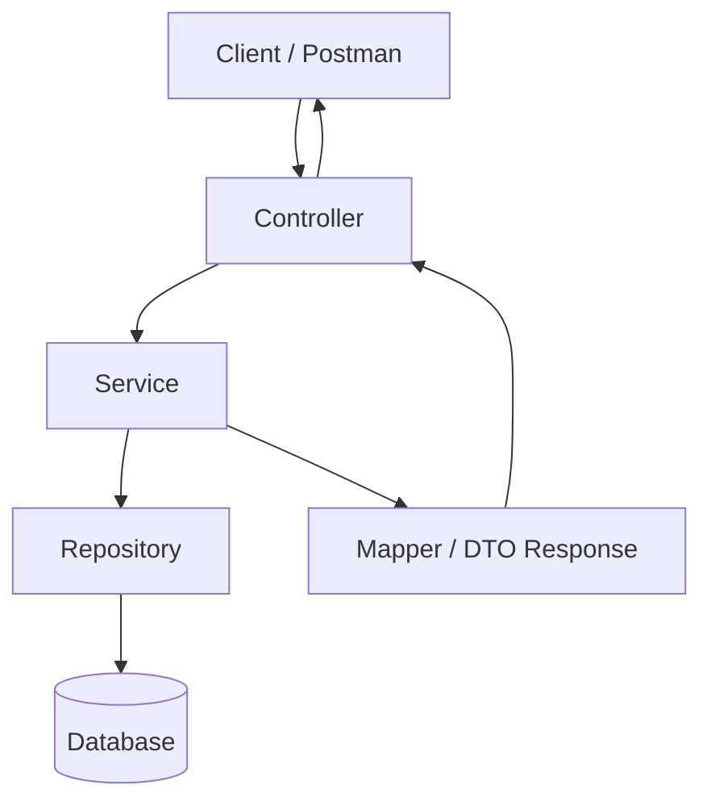

Controller nhận request từ client. Service xử lý nghiệp vụ chính. Repository giao tiếp với database. Sau khi xử lý xong, dữ liệu được chuyển thành DTO Response và trả về client.

---

# 3. AUTH MODULE

---

## 3.1 Đăng ký tài khoản

### Mục đích

Chức năng đăng ký dùng để tạo tài khoản mới cho người dùng. Người dùng có thể đăng ký với vai trò `ADMIN`, `EMPLOYER` hoặc `CANDIDATE`.

### API

```http
POST /api/v1/auth/register
```

### Body

```json
{
  "username": "son",
  "email": "son@gmail.com",
  "password": "123456",
  "role": "CANDIDATE"
}
```

### Luồng hoạt động

Client gửi dữ liệu đăng ký lên `AuthController.register()`.

Controller nhận dữ liệu dưới dạng `RegisterRequest`, sau đó gọi `UserService.register()`.

Trong `UserServiceImpl.register()`, hệ thống kiểm tra username đã tồn tại chưa bằng `userRepository.existsByUsername()`.

Nếu username đã tồn tại, hệ thống ném `DuplicateResourceException`.

Nếu username hợp lệ, hệ thống kiểm tra tiếp email bằng `userRepository.existsByEmail()`.

Nếu email đã tồn tại, hệ thống ném `DuplicateResourceException`.

Nếu dữ liệu hợp lệ, password được mã hóa bằng `passwordEncoder.encode()`.

Sau đó hệ thống tạo entity `User`, set `active = true`, lưu vào database bằng `userRepository.save()`.

Cuối cùng trả về `UserResponse`.

### Sơ đồ luồng hoạt động

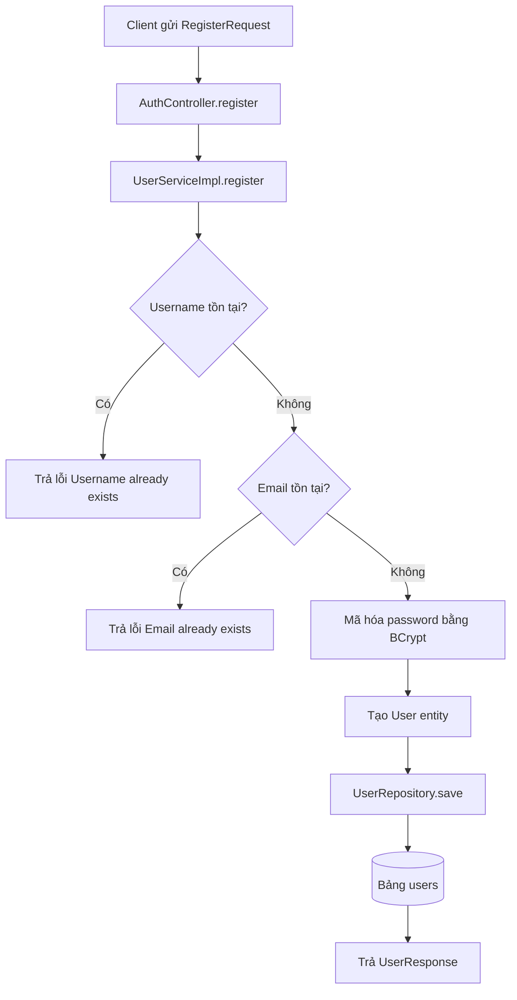

### Response thành công

```json
{
  "id": 1,
  "username": "son",
  "email": "son@gmail.com",
  "role": "CANDIDATE",
  "active": true
}
```

### Test case

| Mã test    | Trường hợp          | Dữ liệu test                   | Kết quả mong đợi          |
| ---------- | ------------------- | ------------------------------ | ------------------------- |
| TC-AUTH-01 | Đăng ký thành công  | username và email chưa tồn tại | Tạo user thành công       |
| TC-AUTH-02 | Trùng username      | username đã tồn tại            | `Username already exists` |
| TC-AUTH-03 | Trùng email         | email đã tồn tại               | `Email already exists`    |
| TC-AUTH-04 | Email sai định dạng | `email = abc`                  | 400 Bad Request           |
| TC-AUTH-05 | Thiếu username      | không gửi username             | 400 Bad Request           |
| TC-AUTH-06 | Thiếu password      | không gửi password             | 400 Bad Request           |

---

## 3.2 Đăng nhập

### Mục đích

Chức năng đăng nhập dùng để xác thực người dùng. Nếu email và password đúng, hệ thống cấp `accessToken` và `refreshToken`.

### API

```http
POST /api/v1/auth/login
```

### Body

```json
{
  "email": "son@gmail.com",
  "password": "123456"
}
```

### Luồng hoạt động

Client gửi email và password lên `AuthController.login()`.

Controller gọi `UserService.login()`.

Trong `UserServiceImpl.login()`, hệ thống tìm user theo email bằng `userRepository.findByEmail()`.

Nếu không tìm thấy email, hệ thống trả lỗi `Email not found`.

Nếu tìm thấy user, hệ thống dùng `passwordEncoder.matches()` để so sánh password người dùng nhập với password đã mã hóa trong database.

Nếu password sai, trả lỗi `Invalid password`.

Nếu password đúng, hệ thống load user bằng `CustomUserDetailsService`.

Sau đó `JwtService.generateToken()` sinh access token.

Tiếp theo `RefreshTokenService.createRefreshToken()` tạo refresh token và lưu vào bảng `refresh_tokens`.

Cuối cùng trả về `AuthResponse`.

### Sơ đồ luồng hoạt động

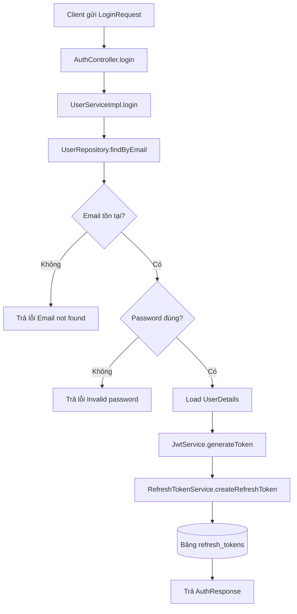

### Response thành công

```json
{
  "accessToken": "eyJhbGciOiJIUzI1NiJ9...",
  "refreshToken": "b4c7-xxxx-xxxx",
  "id": 1,
  "username": "son",
  "email": "son@gmail.com",
  "role": "CANDIDATE"
}
```

### Test case

| Mã test     | Trường hợp          | Dữ liệu test        | Kết quả mong đợi                |
| ----------- | ------------------- | ------------------- | ------------------------------- |
| TC-LOGIN-01 | Login thành công    | email/password đúng | Trả accessToken và refreshToken |
| TC-LOGIN-02 | Email không tồn tại | email sai           | `Email not found`               |
| TC-LOGIN-03 | Password sai        | password sai        | `Invalid password`              |
| TC-LOGIN-04 | Email sai định dạng | `email = abc`       | 400 Bad Request                 |
| TC-LOGIN-05 | Thiếu password      | không gửi password  | 400 Bad Request                 |

---

## 3.3 Refresh Token

### Mục đích

Khi access token hết hạn, người dùng có thể dùng refresh token để lấy access token mới mà không cần đăng nhập lại.

### API

```http
POST /api/v1/auth/refresh-token
```

### Body

```json
{
  "refreshToken": "refresh-token-value"
}
```

### Luồng hoạt động

Client gửi refresh token lên `AuthController.refreshToken()`.

Controller gọi `RefreshTokenService.verifyRefreshToken()`.

Service tìm refresh token trong database bằng `refreshTokenRepository.findByToken()`.

Nếu token không tồn tại, hệ thống trả lỗi `Refresh token not found`.

Nếu token tồn tại nhưng đã hết hạn, hệ thống xóa token đó khỏi database và trả lỗi `Refresh token expired`.

Nếu token hợp lệ, hệ thống lấy user từ refresh token, load user theo email, tạo access token mới bằng `JwtService.generateToken()`.

Cuối cùng trả về `RefreshTokenResponse`.

### Sơ đồ luồng hoạt động

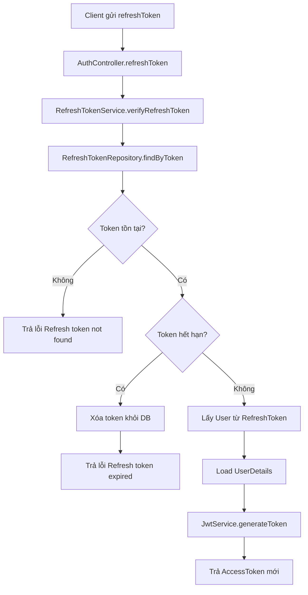

### Response thành công

```json
{
  "accessToken": "new-access-token",
  "refreshToken": "old-refresh-token"
}
```

### Test case

| Mã test       | Trường hợp                  | Kết quả mong đợi          |
| ------------- | --------------------------- | ------------------------- |
| TC-REFRESH-01 | Refresh token hợp lệ        | Trả accessToken mới       |
| TC-REFRESH-02 | Refresh token không tồn tại | `Refresh token not found` |
| TC-REFRESH-03 | Refresh token hết hạn       | `Refresh token expired`   |
| TC-REFRESH-04 | Body rỗng                   | Lỗi xử lý token           |

---

## 3.4 Logout

### Mục đích

Chức năng logout dùng để đăng xuất người dùng bằng cách xóa refresh token khỏi database.

### API

```http
POST /api/v1/auth/logout
```

### Body

```json
{
  "refreshToken": "refresh-token-value"
}
```

### Luồng hoạt động

Client gửi refresh token lên `AuthController.logout()`.

Controller gọi `RefreshTokenService.revokeRefreshToken()`.

Service tìm refresh token bằng `refreshTokenRepository.findByToken()`.

Nếu refresh token tồn tại, hệ thống xóa token khỏi bảng `refresh_tokens`.

Sau khi logout, refresh token đó không còn dùng được để lấy access token mới.

### Sơ đồ luồng hoạt động

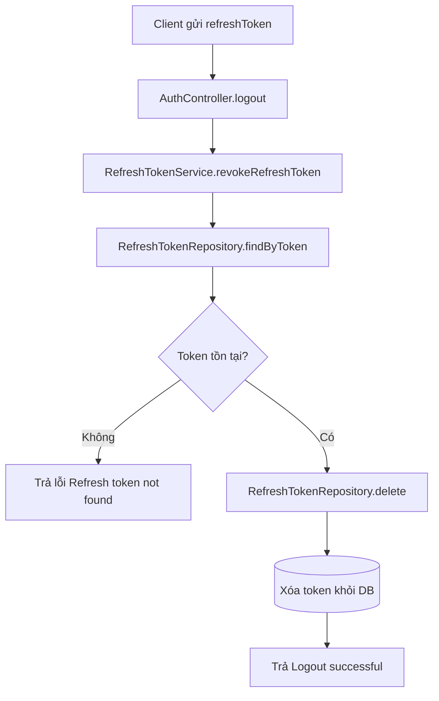

### Response thành công

```text
Logout successful
```

### Test case

| Mã test      | Trường hợp                | Kết quả mong đợi          |
| ------------ | ------------------------- | ------------------------- |
| TC-LOGOUT-01 | Logout thành công         | `Logout successful`       |
| TC-LOGOUT-02 | Token không tồn tại       | `Refresh token not found` |
| TC-LOGOUT-03 | Dùng lại token sau logout | Không refresh được nữa    |

---

## 3.5 Đổi mật khẩu

### Mục đích

Cho phép người dùng đã đăng nhập đổi mật khẩu.

### API

```http
POST /api/v1/auth/change-password
```

### Header

```http
Authorization: Bearer access-token
```

### Body

```json
{
  "oldPassword": "123456",
  "newPassword": "654321"
}
```

### Luồng hoạt động

Client gửi request kèm access token.

`JwtAuthenticationFilter` đọc token trong header `Authorization`.

Filter giải mã token, lấy email người dùng, load user và đưa thông tin vào `SecurityContextHolder`.

`AuthController.changePassword()` lấy email hiện tại bằng `authentication.getName()`.

Controller gọi `UserService.changePassword(email, request)`.

Service tìm user theo email bằng `userRepository.findByEmail()`.

Sau đó kiểm tra mật khẩu cũ bằng `passwordEncoder.matches()`.

Nếu mật khẩu cũ sai, hệ thống trả lỗi `Old password is incorrect`.

Nếu mật khẩu cũ đúng, hệ thống mã hóa mật khẩu mới bằng `passwordEncoder.encode()`.

Cuối cùng lưu password mới vào database.

### Sơ đồ luồng hoạt động

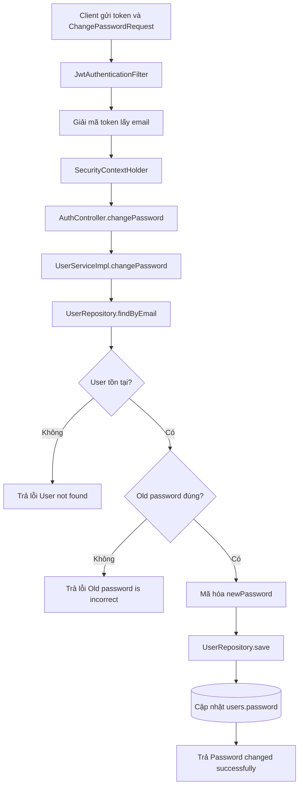

### Response thành công

```text
Password changed successfully
```

### Test case

| Mã test      | Trường hợp                         | Kết quả mong đợi                |
| ------------ | ---------------------------------- | ------------------------------- |
| TC-CHANGE-01 | Đổi mật khẩu thành công            | `Password changed successfully` |
| TC-CHANGE-02 | Sai mật khẩu cũ                    | `Old password is incorrect`     |
| TC-CHANGE-03 | Không gửi token                    | 401 Unauthorized                |
| TC-CHANGE-04 | Token sai                          | 401 Unauthorized                |
| TC-CHANGE-05 | Login bằng password cũ sau khi đổi | Login fail                      |
| TC-CHANGE-06 | Login bằng password mới            | Login thành công                |

---

## 3.6 Quên mật khẩu

### Mục đích

Reset password khi người dùng quên mật khẩu.

### API

```http
POST /api/v1/auth/forgot-password
```

### Body

```json
{
  "email": "son@gmail.com"
}
```

### Luồng hoạt động

Client gửi email lên `AuthController.forgotPassword()`.

Controller gọi `UserService.forgotPassword(email)`.

Service tìm user theo email bằng `userRepository.findByEmail()`.

Nếu email không tồn tại, hệ thống trả lỗi `Email not found`.

Nếu email tồn tại, hệ thống sinh mật khẩu mới theo dạng `Job + số`.

Sau đó mật khẩu mới được mã hóa bằng `passwordEncoder.encode()`.

Cuối cùng lưu mật khẩu mới vào database và trả mật khẩu mới cho client.

### Sơ đồ luồng hoạt động

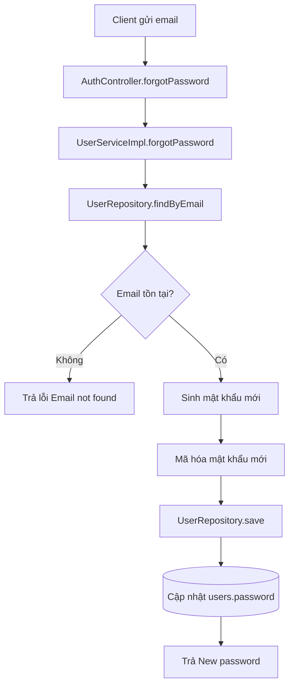

### Response thành công

```text
New password: Job5732
```

### Test case

| Mã test      | Trường hợp              | Kết quả mong đợi  |
| ------------ | ----------------------- | ----------------- |
| TC-FORGOT-01 | Reset thành công        | Trả password mới  |
| TC-FORGOT-02 | Email không tồn tại     | `Email not found` |
| TC-FORGOT-03 | Login bằng password cũ  | Login fail        |
| TC-FORGOT-04 | Login bằng password mới | Login thành công  |

---

# 4. USER MODULE

---

## 4.1 Lấy danh sách user

### API

```http
GET /api/v1/users
```

### Luồng hoạt động

Client gọi `UserController.getAllUsers()`.

Controller gọi `UserService.getAllUsers()`.

Service gọi `userRepository.findAll()` để lấy toàn bộ user.

Danh sách entity `User` được map sang `UserResponse` bằng `UserMapper`.

Kết quả trả về là danh sách user.

### Sơ đồ luồng hoạt động

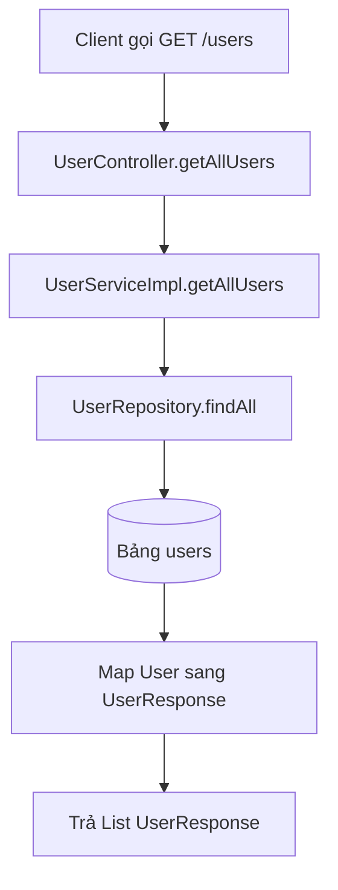

### Test case

| Mã test    | Trường hợp                          | Kết quả mong đợi   |
| ---------- | ----------------------------------- | ------------------ |
| TC-USER-01 | Có user trong DB                    | Trả danh sách user |
| TC-USER-02 | Không có user                       | Trả list rỗng      |
| TC-USER-03 | API protected nhưng không gửi token | 401 Unauthorized   |

---

## 4.2 Lấy user theo ID

### API

```http
GET /api/v1/users/{id}
```

### Luồng hoạt động

Controller nhận `id` từ path variable.

Service gọi `userRepository.findById(id)`.

Nếu tìm thấy user, hệ thống map sang `UserResponse`.

Nếu không tìm thấy, hệ thống ném `ResourceNotFoundException`.

### Sơ đồ luồng hoạt động

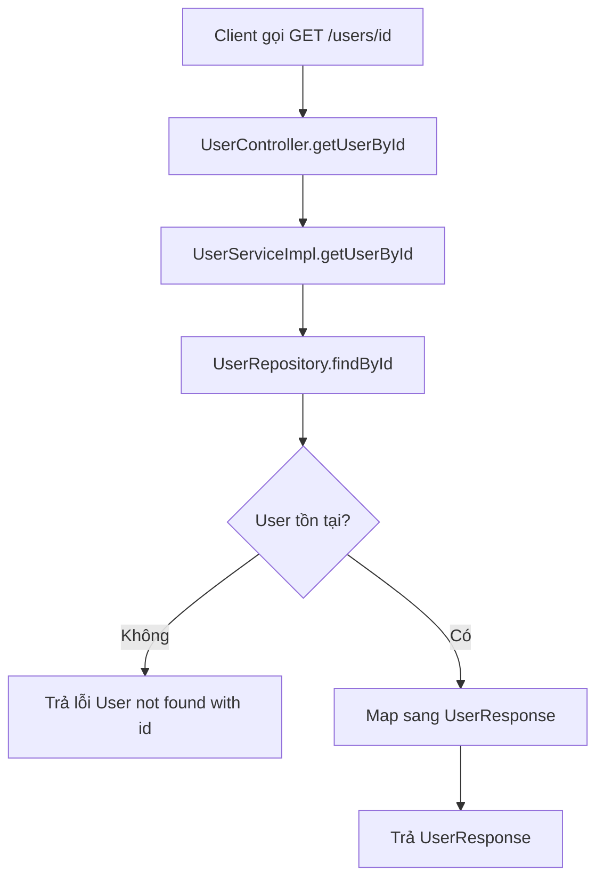

### Test case

| Mã test    | Trường hợp       | Kết quả mong đợi         |
| ---------- | ---------------- | ------------------------ |
| TC-USER-04 | ID tồn tại       | Trả thông tin user       |
| TC-USER-05 | ID không tồn tại | `User not found with id` |
| TC-USER-06 | ID sai định dạng | 400 Bad Request          |

---

## 4.3 Xóa user

### API

```http
DELETE /api/v1/users/{id}
```

### Luồng hoạt động

Controller nhận id.

Service tìm user bằng `userRepository.findById(id)`.

Nếu user không tồn tại, trả lỗi.

Nếu user tồn tại, gọi `userRepository.delete(user)` để xóa.

### Sơ đồ luồng hoạt động

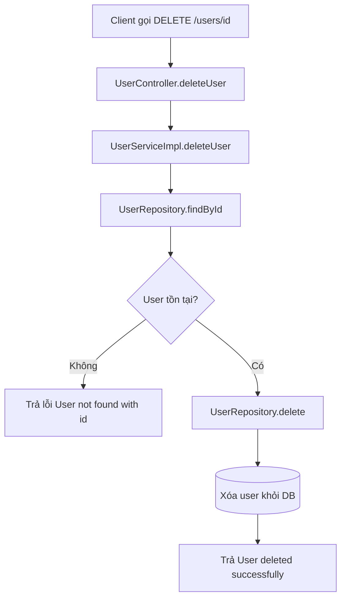

### Response thành công

```text
User deleted successfully
```

### Test case

| Mã test    | Trường hợp             | Kết quả mong đợi            |
| ---------- | ---------------------- | --------------------------- |
| TC-USER-07 | Xóa user tồn tại       | `User deleted successfully` |
| TC-USER-08 | Xóa user không tồn tại | `User not found with id`    |
| TC-USER-09 | Xóa xong tìm lại       | Không tìm thấy user         |

---

## 4.4 Tìm kiếm user

### API

```http
GET /api/v1/users/search?keyword=son
```

### Luồng hoạt động

Controller lấy `keyword` từ query param.

Service gọi `userRepository.findByUsernameContainingIgnoreCase(keyword)`.

Hệ thống tìm user có username chứa keyword, không phân biệt hoa thường.

### Sơ đồ luồng hoạt động

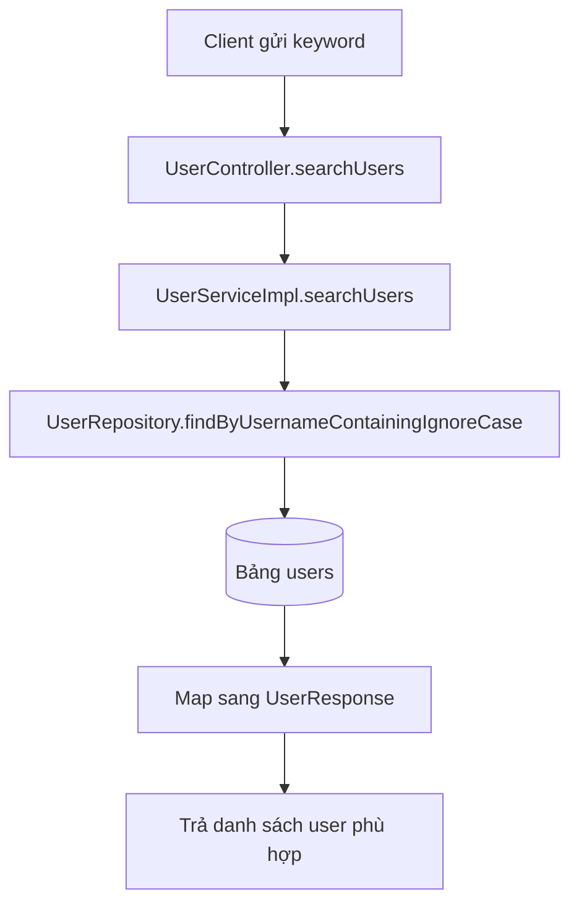

### Test case

| Mã test    | Trường hợp                        | Kết quả mong đợi      |
| ---------- | --------------------------------- | --------------------- |
| TC-USER-10 | Keyword có kết quả                | Trả danh sách phù hợp |
| TC-USER-11 | Keyword không có kết quả          | List rỗng             |
| TC-USER-12 | Keyword viết hoa/thường khác nhau | Vẫn tìm được          |

---

## 4.5 Phân trang user

### API

```http
GET /api/v1/users/page?page=0&size=5
```

### Luồng hoạt động

Controller nhận `page` và `size`.

Service tạo `PageRequest.of(page, size)`.

Repository gọi `findAll(pageable)`.

Kết quả trả về dạng `Page<UserResponse>`.

### Sơ đồ luồng hoạt động

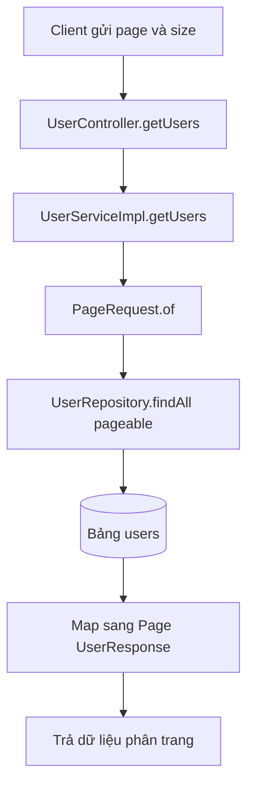

### Test case

| Mã test    | Trường hợp             | Kết quả mong đợi            |
| ---------- | ---------------------- | --------------------------- |
| TC-USER-13 | page=0 size=5          | Trả 5 user đầu              |
| TC-USER-14 | page vượt quá số trang | content rỗng                |
| TC-USER-15 | Không truyền page/size | Dùng mặc định page=0 size=5 |

---

# 5. JOB MODULE

---

## 5.1 Tạo job

### API

```http
POST /api/v1/jobs
```

### Body

```json
{
  "title": "Java Developer",
  "description": "Spring Boot backend",
  "salary": 1500,
  "location": "Ha Noi",
  "deadline": "2026-12-31",
  "employerId": 2
}
```

### Luồng hoạt động

Client gửi thông tin job lên `JobController.createJob()`.

Controller gọi `JobService.createJob()`.

Service kiểm tra employer có tồn tại không bằng `userRepository.findById(employerId)`.

Nếu employer không tồn tại, hệ thống trả lỗi `Employer not found`.

Nếu employer tồn tại, hệ thống tạo entity `Job`.

Trạng thái ban đầu của job là `PENDING`, nghĩa là job đang chờ admin duyệt.

Sau đó job được lưu vào database bằng `jobRepository.save(job)`.

### Sơ đồ luồng hoạt động

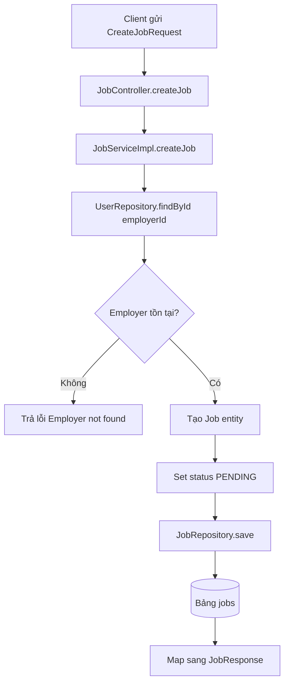

### Test case

| Mã test   | Trường hợp             | Kết quả mong đợi             |
| --------- | ---------------------- | ---------------------------- |
| TC-JOB-01 | Tạo job hợp lệ         | Job được tạo, status PENDING |
| TC-JOB-02 | Employer không tồn tại | `Employer not found`         |
| TC-JOB-03 | Thiếu title            | 400 Bad Request              |
| TC-JOB-04 | Thiếu salary           | 400 Bad Request              |
| TC-JOB-05 | Thiếu deadline         | 400 Bad Request              |

---

## 5.2 Lấy danh sách job

### API

```http
GET /api/v1/jobs
```

### Luồng hoạt động

Controller gọi `JobService.getAllJobs()`.

Service gọi `jobRepository.findAll()`.

Danh sách `Job` được map sang danh sách `JobResponse`.

### Sơ đồ luồng hoạt động

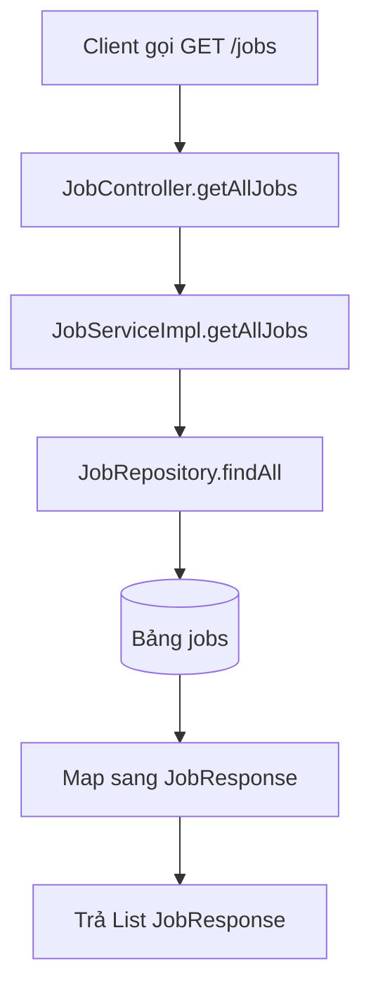

### Test case

| Mã test   | Trường hợp   | Kết quả mong đợi  |
| --------- | ------------ | ----------------- |
| TC-JOB-06 | Có job       | Trả danh sách job |
| TC-JOB-07 | Không có job | List rỗng         |

---

## 5.3 Lấy job theo ID

### API

```http
GET /api/v1/jobs/{id}
```

### Sơ đồ luồng hoạt động

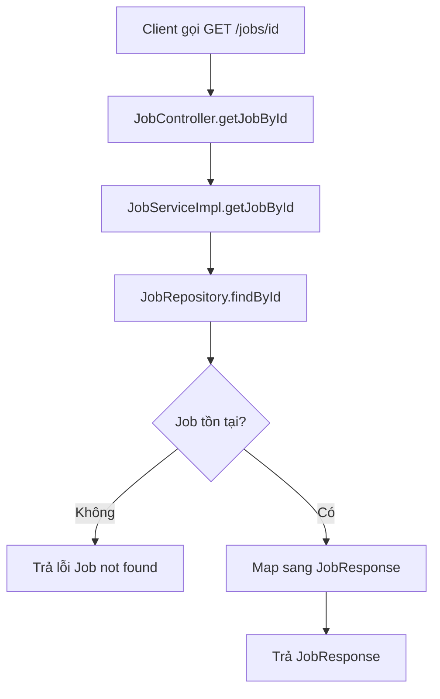

### Test case

| Mã test   | Trường hợp       | Kết quả mong đợi  |
| --------- | ---------------- | ----------------- |
| TC-JOB-08 | ID tồn tại       | Trả thông tin job |
| TC-JOB-09 | ID không tồn tại | `Job not found`   |

---

## 5.4 Cập nhật job

### API

```http
PUT /api/v1/jobs/{id}
```

### Body

```json
{
  "title": "Senior Java Developer",
  "description": "Java Spring Boot",
  "salary": 2000,
  "location": "Ha Noi",
  "deadline": "2026-12-31"
}
```

### Sơ đồ luồng hoạt động

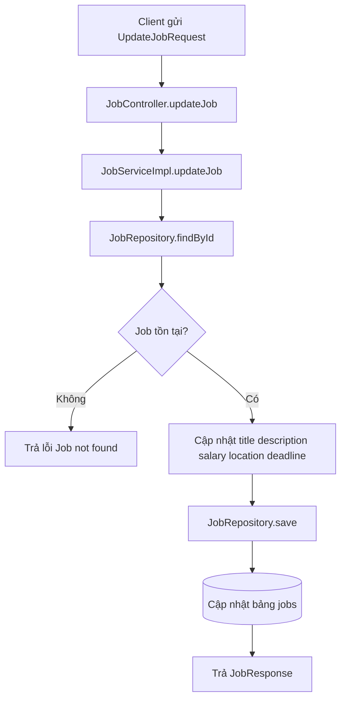

### Test case

| Mã test   | Trường hợp        | Kết quả mong đợi  |
| --------- | ----------------- | ----------------- |
| TC-JOB-10 | Update thành công | Job được cập nhật |
| TC-JOB-11 | Job không tồn tại | `Job not found`   |
| TC-JOB-12 | Thiếu title       | 400 Bad Request   |

---

## 5.5 Xóa job

### API

```http
DELETE /api/v1/jobs/{id}
```

### Sơ đồ luồng hoạt động

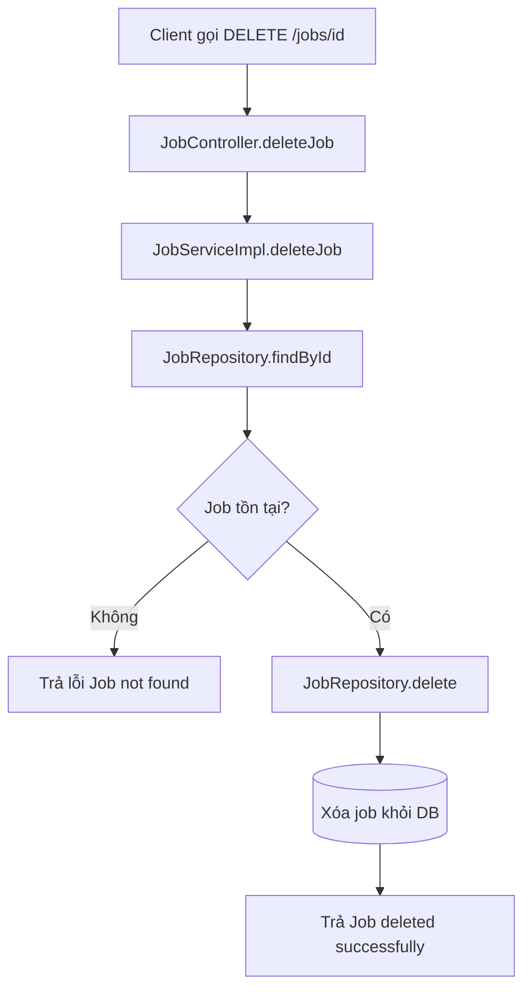

### Test case

| Mã test   | Trường hợp            | Kết quả mong đợi           |
| --------- | --------------------- | -------------------------- |
| TC-JOB-13 | Xóa job tồn tại       | `Job deleted successfully` |
| TC-JOB-14 | Xóa job không tồn tại | `Job not found`            |

---

## 5.6 Approve job

### API

```http
PUT /api/v1/jobs/{id}/approve
```

### Luồng hoạt động

Admin gọi API duyệt job.

Service tìm job theo id.

Nếu job tồn tại, hệ thống set status thành `APPROVED`.

Sau đó lưu lại database.

### Sơ đồ luồng hoạt động

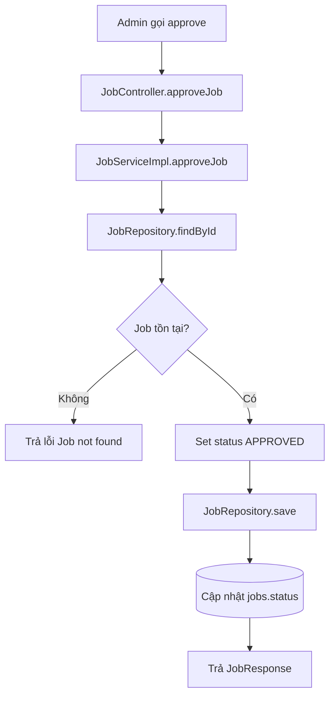

### Test case

| Mã test   | Trường hợp          | Kết quả mong đợi  |
| --------- | ------------------- | ----------------- |
| TC-JOB-15 | Approve job tồn tại | status = APPROVED |
| TC-JOB-16 | Job không tồn tại   | `Job not found`   |

---

## 5.7 Reject job

### API

```http
PUT /api/v1/jobs/{id}/reject
```

### Sơ đồ luồng hoạt động

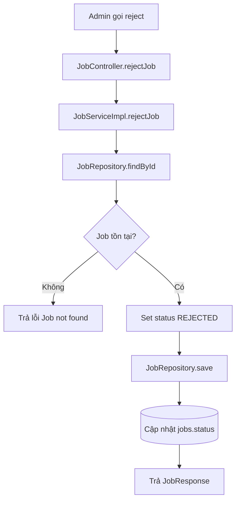

### Test case

| Mã test   | Trường hợp         | Kết quả mong đợi  |
| --------- | ------------------ | ----------------- |
| TC-JOB-17 | Reject job tồn tại | status = REJECTED |
| TC-JOB-18 | Job không tồn tại  | `Job not found`   |

---

## 5.8 Search job

### API

```http
GET /api/v1/jobs/search?keyword=java
```

### Sơ đồ luồng hoạt động

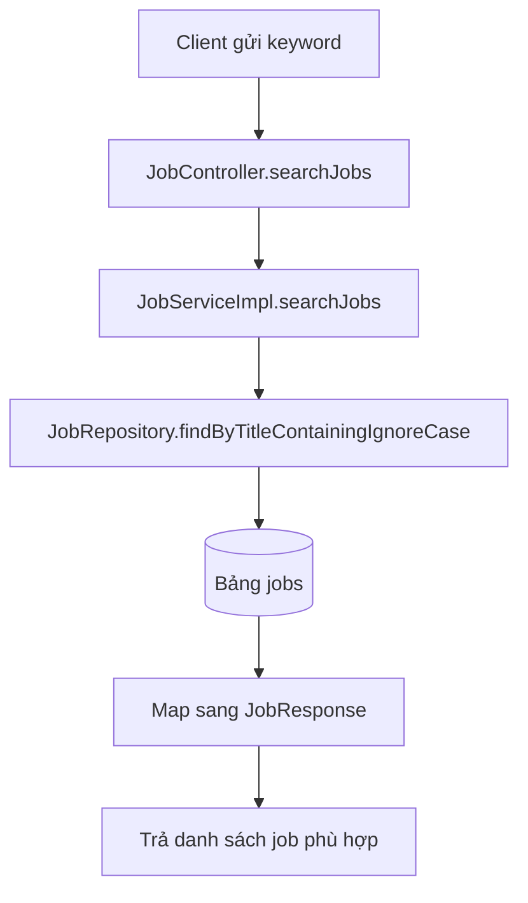

### Test case

| Mã test   | Trường hợp               | Kết quả mong đợi  |
| --------- | ------------------------ | ----------------- |
| TC-JOB-19 | Keyword có kết quả       | Trả danh sách job |
| TC-JOB-20 | Keyword không có kết quả | List rỗng         |
| TC-JOB-21 | Keyword khác hoa thường  | Vẫn tìm được      |

---

## 5.9 Phân trang job

### API

```http
GET /api/v1/jobs/paging?page=0&size=5
```

### Sơ đồ luồng hoạt động

```mermaid
flowchart TD
    A[Client gửi page và size] --> B[JobController.getJobs]
    B --> C[JobServiceImpl.getJobs]
    C --> D[PageRequest.of]
    D --> E[JobRepository.findAll pageable]
    E --> F[(Bảng jobs)]
    F --> G[Map sang Page JobResponse]
    G --> H[Trả dữ liệu phân trang]
```

### Test case

| Mã test   | Trường hợp             | Kết quả mong đợi |
| --------- | ---------------------- | ---------------- |
| TC-JOB-22 | page=0 size=5          | Trả 5 job đầu    |
| TC-JOB-23 | page vượt quá số trang | content rỗng     |
| TC-JOB-24 | Không truyền page/size | Dùng mặc định    |

---

# 6. APPLICATION MODULE

---

## 6.1 Ứng tuyển job

### API

```http
POST /api/v1/applications/apply
```

### Body

```json
{
  "candidateId": 1,
  "jobId": 2,
  "coverLetter": "Tôi muốn ứng tuyển vị trí này."
}
```

### Luồng hoạt động

Client gửi candidateId, jobId và coverLetter.

Controller gọi `ApplicationService.applyJob()`.

Service tìm candidate bằng `userRepository.findById(candidateId)`.

Nếu candidate không tồn tại, hệ thống trả lỗi `Candidate not found`.

Service tiếp tục tìm job bằng `jobRepository.findById(jobId)`.

Nếu job không tồn tại, hệ thống trả lỗi `Job not found`.

Nếu cả candidate và job đều hợp lệ, hệ thống tạo entity `Application`.

Application được set:

* candidate
* job
* coverLetter
* appliedAt = thời gian hiện tại
* status = PENDING

Sau đó lưu vào bảng `applications`.

### Sơ đồ luồng hoạt động

```mermaid
flowchart TD
    A[Client gửi ApplyJobRequest] --> B[ApplicationController.applyJob]
    B --> C[ApplicationServiceImpl.applyJob]
    C --> D[UserRepository.findById candidateId]
    D --> E{Candidate tồn tại?}
    E -- Không --> F[Trả lỗi Candidate not found]
    E -- Có --> G[JobRepository.findById jobId]
    G --> H{Job tồn tại?}
    H -- Không --> I[Trả lỗi Job not found]
    H -- Có --> J[Tạo Application]
    J --> K[Set status PENDING]
    K --> L[ApplicationRepository.save]
    L --> M[(Bảng applications)]
    M --> N[Trả ApplicationResponse]
```

### Test case

| Mã test   | Trường hợp              | Kết quả mong đợi           |
| --------- | ----------------------- | -------------------------- |
| TC-APP-01 | Apply thành công        | Application status PENDING |
| TC-APP-02 | Candidate không tồn tại | `Candidate not found`      |
| TC-APP-03 | Job không tồn tại       | `Job not found`            |
| TC-APP-04 | Thiếu candidateId       | 400 Bad Request            |
| TC-APP-05 | Thiếu jobId             | 400 Bad Request            |

---

## 6.2 Xem hồ sơ theo candidate

### API

```http
GET /api/v1/applications/candidate/{candidateId}
```

### Sơ đồ luồng hoạt động

```mermaid
flowchart TD
    A[Client gọi applications/candidate/id] --> B[ApplicationController.getApplicationsByCandidate]
    B --> C[ApplicationServiceImpl.getApplicationsByCandidate]
    C --> D[ApplicationRepository.findByCandidateId]
    D --> E[(Bảng applications)]
    E --> F[Map sang ApplicationResponse]
    F --> G[Trả danh sách hồ sơ]
```

### Test case

| Mã test   | Trường hợp               | Kết quả mong đợi          |
| --------- | ------------------------ | ------------------------- |
| TC-APP-06 | Candidate có hồ sơ       | Trả danh sách application |
| TC-APP-07 | Candidate chưa ứng tuyển | List rỗng                 |

---

## 6.3 Xem hồ sơ theo job

### API

```http
GET /api/v1/applications/job/{jobId}
```

### Sơ đồ luồng hoạt động

```mermaid
flowchart TD
    A[Client gọi applications/job/id] --> B[ApplicationController.getApplicationsByJob]
    B --> C[ApplicationServiceImpl.getApplicationsByJob]
    C --> D[ApplicationRepository.findByJobId]
    D --> E[(Bảng applications)]
    E --> F[Map sang ApplicationResponse]
    F --> G[Trả danh sách hồ sơ theo job]
```

### Test case

| Mã test   | Trường hợp           | Kết quả mong đợi    |
| --------- | -------------------- | ------------------- |
| TC-APP-08 | Job có ứng viên      | Trả danh sách hồ sơ |
| TC-APP-09 | Job chưa có ứng viên | List rỗng           |

---

## 6.4 Cập nhật trạng thái hồ sơ

### API

```http
PUT /api/v1/applications/{id}/status
```

### Body

```json
{
  "status": "INTERVIEWING"
}
```

### Luồng hoạt động

Employer hoặc admin cập nhật trạng thái hồ sơ.

Controller nhận application id và status mới.

Service tìm application theo id bằng `applicationRepository.findById()`.

Nếu application không tồn tại, hệ thống trả lỗi `Application not found`.

Nếu tồn tại, hệ thống cập nhật status mới và lưu database.

### Sơ đồ luồng hoạt động

```mermaid
flowchart TD
    A[Client gửi status mới] --> B[ApplicationController.updateStatus]
    B --> C[ApplicationServiceImpl.updateStatus]
    C --> D[ApplicationRepository.findById]
    D --> E{Application tồn tại?}
    E -- Không --> F[Trả lỗi Application not found]
    E -- Có --> G[Set status mới]
    G --> H[ApplicationRepository.save]
    H --> I[(Cập nhật applications.status)]
    I --> J[Trả ApplicationResponse]
```

### Status hợp lệ

```text
PENDING
REVIEWING
INTERVIEWING
ACCEPTED
REJECTED
```

### Test case

| Mã test   | Trường hợp                | Kết quả mong đợi        |
| --------- | ------------------------- | ----------------------- |
| TC-APP-10 | Update thành công         | status được cập nhật    |
| TC-APP-11 | Application không tồn tại | `Application not found` |
| TC-APP-12 | Status sai enum           | 400 Bad Request         |

---

# 7. FILE MODULE

---

## 7.1 Upload CV

### API

```http
POST /api/v1/files/upload-cv/{userId}
```

### Postman

Body chọn `form-data`.

Key:

```text
file
```

Type:

```text
File
```

Value:

Chọn file CV từ máy.

### Luồng hoạt động

Client gửi file dạng MultipartFile.

Controller nhận `userId` từ path variable và file từ request param.

Controller gọi `FileStorageService.uploadCv(userId, file)`.

Service tìm user bằng `userRepository.findById(userId)`.

Nếu user không tồn tại, hệ thống trả lỗi `User not found`.

Nếu user tồn tại, hệ thống tạo tên file mới bằng thời gian hiện tại cộng với tên file gốc.

Sau đó tạo thư mục `uploads/cv` nếu chưa tồn tại.

File được ghi xuống thư mục này bằng `Files.write()`.

Sau khi lưu file thành công, hệ thống cập nhật `cvUrl` của user.

Cuối cùng lưu user lại database.

### Sơ đồ luồng hoạt động

```mermaid
flowchart TD
    A[Client gửi MultipartFile] --> B[FileController.uploadCv]
    B --> C[FileStorageServiceImpl.uploadCv]
    C --> D[UserRepository.findById]
    D --> E{User tồn tại?}
    E -- Không --> F[Trả lỗi User not found]
    E -- Có --> G[Tạo tên file mới]
    G --> H[Tạo thư mục uploads/cv]
    H --> I[Ghi file xuống ổ cứng]
    I --> J[Cập nhật user.cvUrl]
    J --> K[UserRepository.save]
    K --> L[(Cập nhật bảng users)]
    L --> M[Trả đường dẫn file]
```

### Response thành công

```text
uploads/cv/1718171000000_cv.pdf
```

### Test case

| Mã test    | Trường hợp         | Kết quả mong đợi   |
| ---------- | ------------------ | ------------------ |
| TC-FILE-01 | Upload thành công  | Trả đường dẫn file |
| TC-FILE-02 | User không tồn tại | `User not found`   |
| TC-FILE-03 | Không chọn file    | `Upload failed`    |
| TC-FILE-04 | File rỗng          | `Upload failed`    |

---

# 8. AOP LOGGING

## Mục đích

AOP Logging dùng để ghi lại thời gian thực hiện của các chức năng trong hệ thống.

Thay vì viết log thủ công trong từng controller hoặc service, hệ thống dùng `LoggingAspect` để tự động bắt các method.

### Luồng hoạt động

Khi người dùng gọi API, request đi vào controller.

Trước khi method controller hoặc service chạy, `LoggingAspect` bắt đầu tính thời gian.

Sau khi method chạy xong, aspect tính tổng thời gian thực thi.

Sau đó ghi log ra console và file `logs/job-platform.log`.

### Sơ đồ luồng hoạt động

```mermaid
flowchart TD
    A[Client gọi API] --> B[Controller Method]
    B --> C[LoggingAspect bắt đầu timer]
    C --> D[Service Method chạy]
    D --> E[LoggingAspect tính thời gian]
    E --> F[Ghi log ra Console]
    E --> G[Ghi log ra file job-platform.log]
```

### Ví dụ log

```text
UserServiceImpl.register executed in 396 ms
AuthController.register executed in 396 ms
JobServiceImpl.createJob executed in 120 ms
ApplicationServiceImpl.applyJob executed in 80 ms
```

### Test case

| Mã test   | Trường hợp         | Kết quả mong đợi                                       |
| --------- | ------------------ | ------------------------------------------------------ |
| TC-LOG-01 | Gọi API register   | Có log AuthController và UserServiceImpl               |
| TC-LOG-02 | Gọi API create job | Có log JobController và JobServiceImpl                 |
| TC-LOG-03 | Gọi API apply job  | Có log ApplicationController và ApplicationServiceImpl |
| TC-LOG-04 | Kiểm tra file log  | Có file `logs/job-platform.log`                        |
| TC-LOG-05 | API lỗi            | Có log lỗi hoặc exception                              |

---

# 9. GLOBAL EXCEPTION HANDLER

## Mục đích

`GlobalExceptionHandler` giúp xử lý lỗi tập trung. Thay vì mỗi controller tự xử lý lỗi, toàn bộ exception được gom về một nơi.

### Sơ đồ luồng hoạt động

```mermaid
flowchart TD
    A[Service phát sinh Exception] --> B[GlobalExceptionHandler]
    B --> C{Loại Exception}
    C --> D[ResourceNotFoundException - 404]
    C --> E[DuplicateResourceException - 409]
    C --> F[BadRequestException - 400]
    C --> G[UnauthorizedException - 401]
    C --> H[ForbiddenException - 403]
    C --> I[Exception - 500]
    D --> J[Trả ErrorResponse]
    E --> J
    F --> J
    G --> J
    H --> J
    I --> J
```

### Test case

| Mã test  | Trường hợp             | Kết quả mong đợi          |
| -------- | ---------------------- | ------------------------- |
| TC-EX-01 | Tìm user không tồn tại | 404 NOT_FOUND             |
| TC-EX-02 | Đăng ký email trùng    | 409 CONFLICT              |
| TC-EX-03 | Validation lỗi         | 400 Bad Request           |
| TC-EX-04 | Lỗi không xác định     | 500 INTERNAL_SERVER_ERROR |

---

# 10. Kịch bản test Postman tổng hợp

## Bước 1: Đăng ký Candidate

```http
POST /api/v1/auth/register
```

```json
{
  "username": "candidate01",
  "email": "candidate01@gmail.com",
  "password": "123456",
  "role": "CANDIDATE"
}
```

## Bước 2: Đăng ký Employer

```json
{
  "username": "employer01",
  "email": "employer01@gmail.com",
  "password": "123456",
  "role": "EMPLOYER"
}
```

## Bước 3: Login Employer

```http
POST /api/v1/auth/login
```

```json
{
  "email": "employer01@gmail.com",
  "password": "123456"
}
```

Copy `accessToken` và `refreshToken`.

## Bước 4: Tạo Job

```http
POST /api/v1/jobs
```

```json
{
  "title": "Java Developer",
  "description": "Spring Boot Backend",
  "salary": 1500,
  "location": "Ha Noi",
  "deadline": "2026-12-31",
  "employerId": 2
}
```

## Bước 5: Duyệt Job

```http
PUT /api/v1/jobs/1/approve
```

## Bước 6: Login Candidate

```json
{
  "email": "candidate01@gmail.com",
  "password": "123456"
}
```

## Bước 7: Upload CV

```http
POST /api/v1/files/upload-cv/1
```

Body chọn `form-data`, key là `file`, type là `File`.

## Bước 8: Candidate Apply Job

```http
POST /api/v1/applications/apply
```

```json
{
  "candidateId": 1,
  "jobId": 1,
  "coverLetter": "Tôi muốn ứng tuyển vị trí Java Developer."
}
```

## Bước 9: Employer xem hồ sơ theo Job

```http
GET /api/v1/applications/job/1
```

## Bước 10: Cập nhật trạng thái hồ sơ

```http
PUT /api/v1/applications/1/status
```

```json
{
  "status": "INTERVIEWING"
}
```

## Bước 11: Candidate xem lịch sử ứng tuyển

```http
GET /api/v1/applications/candidate/1
```

## Bước 12: Đổi mật khẩu

```http
POST /api/v1/auth/change-password
```

Header:

```http
Authorization: Bearer access-token
```

Body:

```json
{
  "oldPassword": "123456",
  "newPassword": "654321"
}
```

## Bước 13: Quên mật khẩu

```http
POST /api/v1/auth/forgot-password
```

```json
{
  "email": "candidate01@gmail.com"
}
```

## Bước 14: Logout

```http
POST /api/v1/auth/logout
```

```json
{
  "refreshToken": "refresh-token-value"
}
```

---

# 11. Kết luận

Tài liệu này mô tả chi tiết toàn bộ các chức năng hiện có trong hệ thống Job Platform System.

Các chức năng đã được mô tả gồm:

* Đăng ký
* Đăng nhập
* Refresh Token
* Logout
* Đổi mật khẩu
* Quên mật khẩu
* Quản lý user
* Quản lý job
* Duyệt job
* Từ chối job
* Tìm kiếm job
* Phân trang job
* Apply job
* Xem hồ sơ theo candidate
* Xem hồ sơ theo job
* Cập nhật trạng thái hồ sơ
* Upload CV
* AOP Logging
* Global Exception Handler

Tài liệu có thể dùng để giải thích luồng hoạt động khi bảo vệ đồ án hoặc làm file hướng dẫn cho người tiếp tục phát triển dự án.
